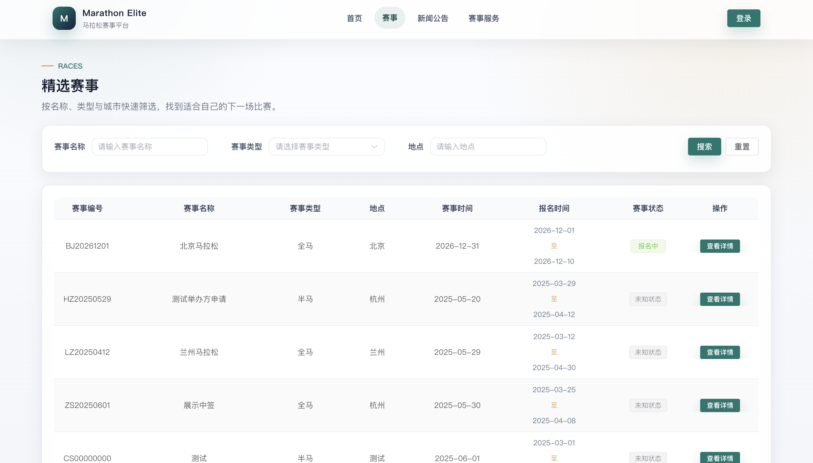
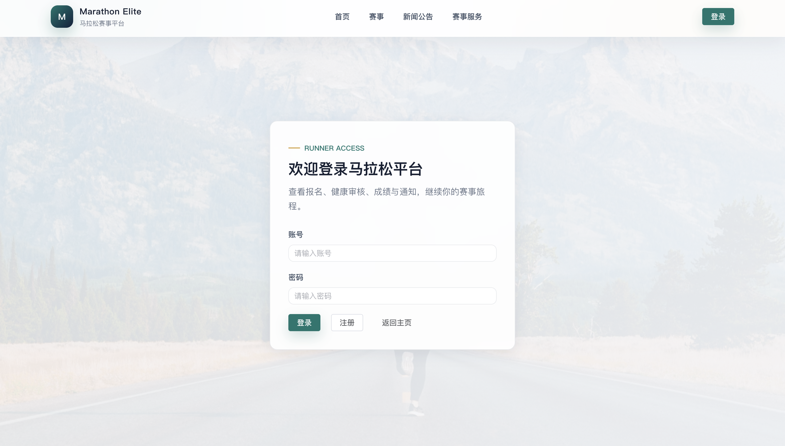
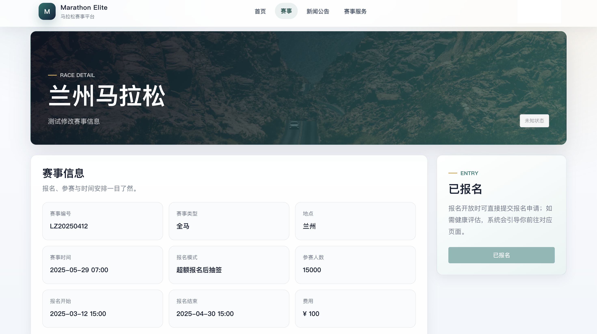
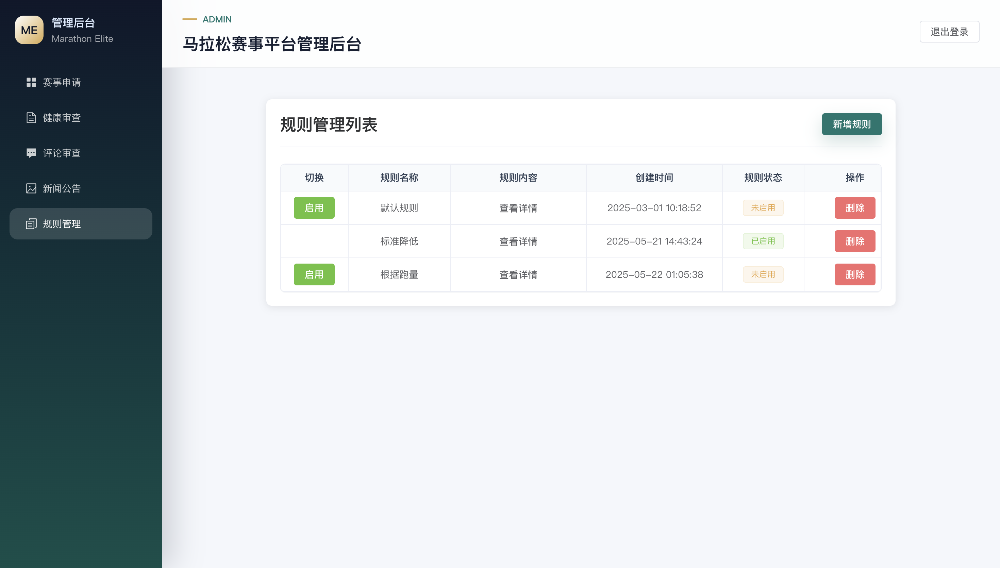
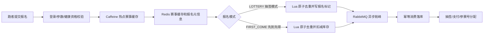

# Marathon - 高并发马拉松赛事报名与抽签平台

这是一个前后端同仓库的马拉松赛事系统，面向跑者、赛事主办方和管理员三类角色。项目重点展示热门赛事报名场景下的高并发受理、Redis Lua 原子去重/扣库存、RabbitMQ 异步削峰、抽签、支付状态一致性和多角色后台管理。

## 项目界面预览

| 首页 | 赛事列表 |
| --- | --- |
|  |  |

| 跑者登录 | 赛事详情 | 管理员界面 |
| --- | --- | --- |
|  |  |  |

## 核心亮点

- 双模式报名：大型赛事支持 `LOTTERY` 超额报名后抽签，小型赛事支持 `FIRST_COME` 限额报名报完即止。
- 高并发临界区：Redis Lua 原子完成重复报名判断、报名标记写入和先到先得库存扣减。
- 削峰落库：报名接口快速返回“已受理”，RabbitMQ 异步消费并落库。
- 幂等保障：Redis 前置标记、消费端查重和 MySQL 唯一索引共同防止重复报名。
- 热点缓存：Caffeine + Redis + MySQL 多级缓存降低热门赛事详情读取压力。
- 业务完整性：抽签、支付、参赛号分配、成绩上传、健康资格审核和通知链路形成闭环。
- 规则与通知：Drools 支持动态健康资格规则，WebSocket 支持赛事通知。

## 核心报名链路



## 功能模块

- 跑者端：赛事浏览、赛事详情、报名、支付、健康材料提交、成绩查询、通知查看。
- 主办方端：赛事申请、赛事信息维护、路线管理、报名名单、抽签、成绩模板下载与上传。
- 管理员端：主办方申请审核、健康审核、新闻管理、评论审核、动态规则管理。
- 系统能力：JWT 鉴权、多角色路由、MinIO 文件存储、WebSocket 通知、定时维护赛事状态。

## 技术栈

- 后端：Spring Boot 3、Maven 多模块、MyBatis-Plus、MySQL、Redis、Caffeine、RabbitMQ、Drools、MinIO、WebSocket、JWT
- 前端：Vue 3、Vite、TypeScript、Vue Router、Element Plus、Axios、ECharts、Monaco Editor
- 本地环境：Docker Compose、MySQL 8、Redis 7、RabbitMQ Management、MinIO

## 目录结构

```text
.
├── marathon-common        # 公共常量与通用能力
├── marathon-dal           # 数据实体与 Mapper
├── marathon-service       # 核心业务、缓存、MQ、规则、定时任务
├── marathon-webapp        # Spring Boot Web 启动模块与 Controller
├── marathon-web-frontend  # Vue 3 前端项目
├── docs                   # SQL、功能说明和设计记录
└── docker-compose.yml     # 本地中间件编排
```

## 本地启动

环境要求：

- JDK 17
- Maven 3.8+
- Node.js 18+
- npm 9+
- Docker Desktop

启动 MySQL、Redis、RabbitMQ、MinIO：

```bash
docker compose up -d
```

默认 `application.yml` 已提供本地 Docker 环境的安全默认值。如需单独维护本地配置，可从示例文件复制，并使用 `local` profile 启动：

```bash
cp marathon-webapp/src/main/resources/application-local.yml.example \
  marathon-webapp/src/main/resources/application-local.yml
```

启动后端：

```bash
mvn -pl marathon-webapp -am spring-boot:run
```

使用 `application-local.yml` 时：

```bash
mvn -pl marathon-webapp -am spring-boot:run -Dspring-boot.run.profiles=local
```

启动前端：

```bash
cd marathon-web-frontend
npm install
npm run dev
```

默认端口：

- 后端 API：`http://localhost:8700`
- 前端页面：以 Vite 控制台输出为准，通常是 `http://localhost:5173`
- RabbitMQ 管理台：`http://localhost:15672`
- MinIO 控制台：`http://localhost:9001`

## 构建与测试

后端测试：

```bash
mvn -pl marathon-webapp -am test
```

前端构建：

```bash
cd marathon-web-frontend
npm run build
```

## 高并发报名压测

准备一个处于报名时间内的赛事，并使用跑者账号登录拿到 JWT 后，可以用 `hey` 或 `wrk` 压测报名接口：

```bash
hey -n 10000 -c 200 \
  -H "Authorization: Bearer <token>" \
  -H "Content-Type: application/json" \
  -m POST \
  -d '{"raceId":1,"userId":1001}' \
  http://localhost:8700/registration/add
```

重点观察：

- 抽签模式下报名人数可以超过参赛名额，截止后再抽签。
- 先到先得模式下 Redis 库存不会扣成负数。
- 同一用户同一赛事不会重复报名。
- 接口快速返回“报名已受理”，落库由 RabbitMQ 消费端异步完成。
- MySQL 唯一索引 `registration(user_id, race_id)` 作为最终幂等兜底。

## 配置安全说明

GitHub 展示版不会提交真实连接信息。`application.yml` 使用环境变量和本地默认值，例如：

- `MARATHON_DB_URL`
- `MARATHON_DB_USERNAME`
- `MARATHON_DB_PASSWORD`
- `MARATHON_REDIS_HOST`
- `MARATHON_REDIS_PASSWORD`
- `MARATHON_RABBITMQ_HOST`
- `MARATHON_MAIL_USERNAME`
- `MARATHON_MAIL_PASSWORD`
- `MARATHON_MINIO_ACCESS_KEY`
- `MARATHON_MINIO_SECRET_KEY`
- `MARATHON_JWT_SECRET`

